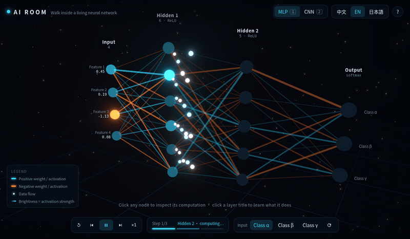
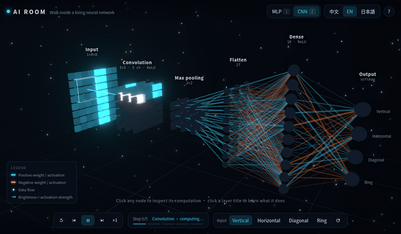
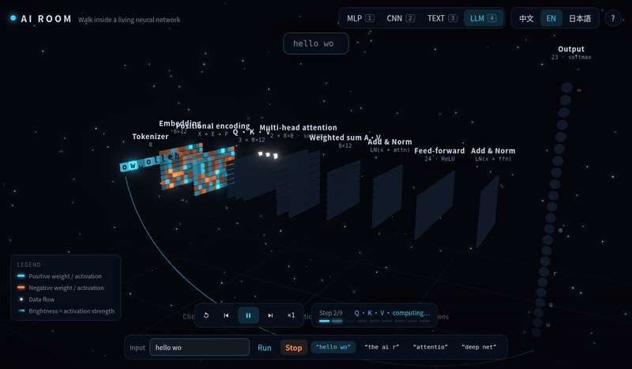
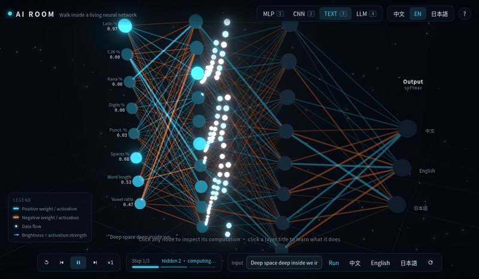
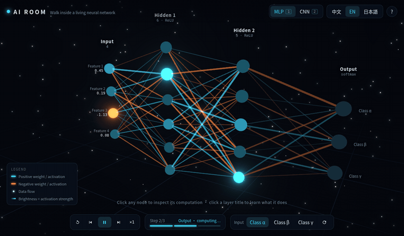
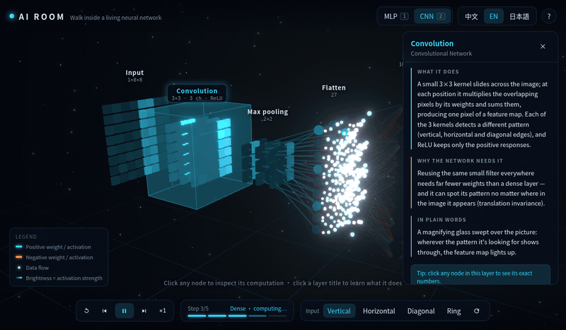

# AI Room

Interactive 3D environment for exploring **real** neural network computation node-by-node, running entirely in the browser. / 走进一个**正在真实运算**的神经网络的 3D 空间，全部在浏览器本地运行。

**🔗 Live: [airoom.run](https://www.airoom.run/)**

by [tanzhuo](https://tanzhuo.xyz) · Blog: **[tanzhuo.xyz](https://tanzhuo.xyz)** · Source: **[github.com/tan-zhuo/ai-room](https://github.com/tan-zhuo/ai-room)** · License: MIT

> **Not an animation — real computation.** Every network is genuinely trained in your browser at load time (deterministic seeds). Every value you see — activations, attention weights, softmax probabilities — is the true result of the forward pass. Click any node and check the arithmetic yourself; type your own text and watch the numbers change.

## Models · 模型架构

### MLP — Multi-Layer Perceptron · 多层感知机

Classifies 3 Gaussian clusters. Watch data-flow particles run through weighted connections, layer by layer.



### CNN — Convolutional Network · 卷积神经网络

Classifies patterns (vertical / horizontal / diagonal / ring). The receptive-field window slides across the input exactly in computation order; pooling windows animate the same way. Three sizes (S/M/L up to 16×16 input, 6 kernels) — switching **retrains the network live**.

Two kernel modes: **hand-crafted** Sobel-style edge detectors (interpretable, only the dense head trains) or **learned** — kernels start as random noise and are trained end-to-end through a hand-written conv backward pass. And a **Draw mode**: paint your own pattern on the input grid and watch the whole network classify it live, stroke by stroke.



### RNN — Recurrent Neural Network · 循环神经网络（Elman）

Char-level next-character prediction on the same corpus as the transformer. The hidden-state sheet computes row by row — one timestep at a time, h_t = tanh(Wx·x_t + Wh·h_{t-1} + b) — with the recurrence arcs drawn between consecutive rows. Trained with hand-written BPTT.

### LSTM — Long Short-Term Memory · 长短期记忆网络

The classic gated recurrent cell, fully visualized: four gate sheets (forget / input / candidate / output), the additive cell-state conveyor belt c = f⊙c′ + i⊙g, and the exposed hidden state h = o⊙tanh(c). Every gate cell opens to its exact math. Same task as the RNN — compare how the two learn.

### Autoencoder · 自编码器

Self-supervised: the 8×8 input is squeezed through a 6-number latent bottleneck and reconstructed, trained by MSE with no labels. Draw your own pattern and watch it survive (or not) the round trip; inspect any output pixel to compare original vs reconstructed values.

Toggle to **VAE**: the bottleneck becomes a distribution (μ, log σ²) with reparameterized sampling z = μ + ε·σ and a KL loss — resample ε to see the stochastic bottleneck, or hit **Generate** to decode z drawn straight from N(0,1): brand-new images from the latent prior.

### Diffusion — DDPM · 扩散模型

A real denoising diffusion model (T=20, linear β schedule) trained in-browser to predict x̂₀ from a noisy image and a sinusoidal timestep embedding. Playback **is** the reverse process: each step feeds x_t through the denoiser, shows its current guess of the clean image, and applies one DDPM posterior update x_{t-1} = c₀·x̂₀ + c_t·x_t + σ·z. Watch a ring or bar emerge from pure noise — and inspect any pixel to see the exact posterior coefficients.

### GAN — Generative Adversarial Network · 生成对抗网络

A vanilla GAN (Goodfellow 2014) trained adversarially in-browser: the generator maps z ~ N(0,1) to an 8×8 image, the discriminator (LeakyReLU + sigmoid) judges the generated image **and** a real sample through the same weights — both branches drawn in 3D. Alternating SGD with the non-saturating G loss reaches a believable equilibrium (D(real) ≈ 0.56, D(fake) ≈ 0.34) and the generator covers 3 of the 4 pattern classes. The verdict badge tells you each round: did G fool D, or did D catch the fake?

### GNN — Graph Neural Network · 图神经网络（GCN）

A 2-layer graph convolutional network (Kipf & Welling) classifying nodes into communities on random graphs **it has never seen** — a fresh graph is sampled every run. The same graph is drawn four times: input features (colored by true community) → message passing ① → message passing ② → prediction (colored by predicted community, with a node-accuracy badge). Flow particles travel along the actual graph edges weighted by  = D^-1/2 (A+I) D^-1/2 — that IS the message passing. Click any node for its neighbour-aggregation table.

### ViT — Vision Transformer · 视觉 Transformer

A faithful miniature ViT (Dosovitskiy 2020) with hand-written forward AND backward passes: the image is cut into 4×4 patches (grid lines drawn on the input), each patch linearly embedded as a token, a **learned [CLS] token** prepended, learned positional embeddings added, then one pre-LN encoder block (bidirectional multi-head attention + FFN, both residual) and classification read from LN([CLS]). Reaches ~98% held-out accuracy on the patterns. Click a patch-token cell and the selection fan shows exactly which 16 pixels feed it.

### Transformer — Tiny char-level LLM · 迷你 Transformer（字符级）

A structurally faithful character-level transformer block with **hand-written forward AND backward passes** (including LayerNorm and residual gradients), trained in-browser on a small corpus (~2.5s):

**Tokenizer → Embedding → Positional Encoding (sinusoidal) → Multi-Head Attention (2 heads, causal, with output projection W_O) → Residual + LayerNorm → Feed-Forward → Residual + LayerNorm → Output softmax**

Both heads' 8×8 attention matrices light up row by row; residual skip connections are drawn when you inspect an Add & Norm cell — down to μ, σ, γ, β. Type a prompt, watch it predict: `"the ai r"` → `o` (room), `"attentio"` → `n` (58%).

Hit **Generate · 连续生成** for true autoregressive decoding: the sampled character is appended to the context, the window slides, the whole pipeline re-runs — and the output streams onto the screen one character at a time, exactly how real LLMs write. A **temperature slider** (0.2–1.4) controls the sampling distribution live.

Toggle to **MoE**: the FFN is replaced by a trained router + 4 experts with top-2 gating — router scores, per-token expert assignments and the weighted combine are all visualized, and the whole MoE variant retrains live when you switch.



## AI Applications · AI 应用

### Lang ID — Language detector · 语言识别（基于 MLP）

**Type anything.** The text becomes 8 interpretable statistics (Latin %, CJK %, kana %, …) and a trained MLP detects 中文 / English / 日本語 — proof the computation is real: your input, its numbers, its prediction.



## True Scale · 真实规模对比

A display-only page (☰ menu → AI Apps → **True Scale**) that draws real production models — GPT-2 XL, GPT-3, Llama 3.1 405B, DeepSeek-V3 — against the mini transformer this site actually trains, with tower heights **linearly proportional to true parameter count** (no log scale). A million-point GPU particle cloud serves as the ruler: GPT-3 ≈ 175,000 such clouds; DeepSeek-V3 is ×328,277,886 our mini model.

The front row **dissects one layer** of the selected model at true matrix shapes: W_Q/K/V/O plates, the FFN towers (visibly 4× the attention — GPT-3's W₁ is 49,152×12,288), Llama's SwiGLU triple and its GQA-shrunk K/V plates, DeepSeek's 256-expert grid with top-8+shared lit, LayerNorm as a barely-visible sliver, and the token-embedding matrix laid on the floor. A param-audit line proves the total: 96 × 1.81B + 0.62B ≈ 175B. A **Token Journey** animation rides one token up through all the real layers — word embedding → syntax → meaning → context disambiguation → whole-sentence fusion — with milestones scaled to the selected model's true depth. Context absorption is VISIBLE: the sentence's words light up one by one as the token absorbs them, and stay lit. Three rotating cases include a contrast pair (Amazon the retailer vs the Amazon rainforest; 中文为 苹果→水果 vs 苹果→公司): the same starting embedding lands on opposite meanings. Specs from the public papers; nothing on this page is computed — that gap is the point.

## Inspect any node · 点开任意节点

Every neuron, feature-map pixel, attention cell shows its exact math: inputs × weights tables, Σ → bias → activation, kernels and receptive fields, q·k/√d products and softmax rows. The numbers add up — check them.



## Module explanations · 模块讲解

Click any layer title: what it does / why the network needs it / a plain-words analogy — in 中文, English and 日本語 — while the layer glows in 3D and everything else dims.



## Controls · 操作

| Input | Action |
| --- | --- |
| Mouse drag / scroll / right-drag | Orbit / zoom / pan |
| Click node · 点击节点 | Inspect its computation |
| Click layer title · 点击层标题 | Module explanation + highlight |
| ☰ menu | Switch between models and AI apps |
| Text box (Lang ID / Transformer) | Run the network on your own input |
| Draw mode (CNN) | Paint the input, classify live |
| Kernel toggle (CNN) | Hand-crafted ↔ learned (end-to-end) kernels |
| Temp slider (Transformer) | Sampling temperature for generation |
| `Space` | Play / pause |
| `←` `→` | Previous / next step |
| `R` | Reset |
| `1` – `6` | Models: MLP / CNN / RNN / LSTM / Transformer / GNN (+ ViT via ☰ menu) |
| `7` – `9` | Generative: Autoencoder / Diffusion / GAN |
| `0` | AI apps: Lang ID |
| `S / M / L` buttons | Network scale — **every** architecture retrains live (L is the largest that still trains in-browser in seconds) |
| `L` | Cycle language 中文 / EN / 日本語 |
| `F` | Focus selected node / layer |
| `Esc` | Close panel / deselect |

## The papers behind each model · 每个模型对应的论文

Every architecture's overview panel (ⓘ) links to its canonical papers. The full list:

| Model | Papers |
| --- | --- |
| MLP | [Backpropagation — Rumelhart, Hinton & Williams 1986](https://www.nature.com/articles/323533a0) · [Perceptron — Rosenblatt 1958](https://psycnet.apa.org/doi/10.1037/h0042519) |
| CNN | [LeNet — LeCun et al. 1998](https://ieeexplore.ieee.org/document/726791) · [AlexNet — Krizhevsky et al. 2012](https://papers.nips.cc/paper/2012/hash/c399862d3b9d6b76c8436e924a68c45b-Abstract.html) |
| RNN | [Finding Structure in Time — Elman 1990](https://onlinelibrary.wiley.com/doi/10.1207/s15516709cog1402_1) · [Long-term dependencies — Bengio et al. 1994](https://ieeexplore.ieee.org/document/279181) |
| LSTM | [Long Short-Term Memory — Hochreiter & Schmidhuber 1997](https://www.bioinf.jku.at/publications/older/2604.pdf) · [Search Space Odyssey — Greff et al. 2015](https://arxiv.org/abs/1503.04069) |
| Transformer | [Attention Is All You Need — Vaswani et al. 2017](https://arxiv.org/abs/1706.03762) · [Sparsely-Gated MoE — Shazeer et al. 2017](https://arxiv.org/abs/1701.06538) · [GPT-3 — Brown et al. 2020](https://arxiv.org/abs/2005.14165) |
| ViT | [An Image is Worth 16x16 Words — Dosovitskiy et al. 2020](https://arxiv.org/abs/2010.11929) · [Attention Is All You Need — Vaswani et al. 2017](https://arxiv.org/abs/1706.03762) · [CLIP — Radford et al. 2021](https://arxiv.org/abs/2103.00020) |
| GNN | [GCN — Kipf & Welling 2016](https://arxiv.org/abs/1609.02907) · [The GNN Model — Scarselli et al. 2009](https://ieeexplore.ieee.org/document/4700287) · [GAT — Veličković et al. 2017](https://arxiv.org/abs/1710.10903) |
| Autoencoder | [Dimensionality Reduction — Hinton & Salakhutdinov 2006](https://www.science.org/doi/10.1126/science.1127647) · [VAE — Kingma & Welling 2013](https://arxiv.org/abs/1312.6114) |
| Diffusion | [DDPM — Ho, Jain & Abbeel 2020](https://arxiv.org/abs/2006.11239) · [Nonequilibrium Thermodynamics — Sohl-Dickstein et al. 2015](https://arxiv.org/abs/1503.03585) · [Latent Diffusion — Rombach et al. 2021](https://arxiv.org/abs/2112.10752) |
| GAN | [Generative Adversarial Networks — Goodfellow et al. 2014](https://arxiv.org/abs/1406.2661) · [StyleGAN — Karras et al. 2018](https://arxiv.org/abs/1812.04948) |
| Lang ID | [Backpropagation — Rumelhart et al. 1986](https://www.nature.com/articles/323533a0) · [N-Gram Text Categorization — Cavnar & Trenkle 1994](https://www.let.rug.nl/vannoord/TextCat/textcat.pdf) |

## Simplifications vs production models · 与生产级模型的差异

Honest list of what is deliberately simplified — the math shown is real, the scale is not:

- One transformer block, 2 heads, d=12, char-level tokens (production: dozens of blocks, subword BPE, d in the thousands); post-LN as in the original paper (modern LLMs mostly use pre-LN); no dropout or weight decay (datasets are tiny and synthetic).
- Training is plain SGD, sample-by-sample (production: Adam, batches, schedulers).
- CNN: single conv+pool stage, stride 1, no padding; datasets are procedurally generated patterns rather than photos.
- Lang ID uses hand-crafted statistical features on purpose — it demonstrates the simplest form of text encoding, not modern embeddings.
- Diffusion: the denoiser is a small MLP over 8×8 images with T=20 steps (production DDPMs: U-Net over high-res images, T≈1000, ε- or v-prediction); ours predicts x̂₀ directly, which is the same family of parameterization.
- GAN: MLP generator/discriminator with one-sided label smoothing (production GANs: convolutional G/D, spectral norm, Adam with tuned β); on 4 simple pattern classes partial mode coverage is expected and visible.

## Development

```bash
npm install
npm run dev      # dev server
npm run build    # type-check + production build (dist/)
npm run sanity   # trains every net at every scale, verifies accuracy
```

Pure frontend, no backend, no runtime network calls. Stack: Vite + React + TypeScript + React Three Fiber + Drei + Zustand.

```
src/
  nn/           # engines: MLP fwd/backprop · CNN conv/pool · transformer fwd/backprop · tasks & training
  store.ts      # zustand: architecture, playback, selection, language, scale
  i18n/         # zh / en / ja dictionaries (UI + module explanations)
  scene/        # R3F: layouts, instanced nodes/connections/particles, slide & attention anims
  ui/           # HUD: transport, inspector, explanations, text entry, tooltip, help
```

## 中文说明（简要）

- **真实计算**：全部十一个网络都在页面加载时用固定随机种子真实训练（`npm run sanity` 可验证准确率）；面板里的每个中间值都是前向传播的真实结果，可以手动对账。
- **三档规模**：所有模型都有 小/中/大 三档，切换时现场重新训练。大档是浏览器几秒内还能训完的「大模型」——而且明显更强：大档 Transformer（d=24、4 头、12 上下文）训练集 top-1 达 100%，RNN loss 从 1.2 降到 0.38，扩散模型升到 12×12 图像、30 步去噪，GAN 生成器/判别器同步加宽。
- **MLP**：三类高斯簇分类，逐层粒子流动画对应真实计算顺序。
- **CNN**：Sobel 边缘卷积核 + 训练的全连接头识别图案；感受野滑窗动画与计算顺序一致；S/M/L 三档规模，切换时现场重新训练。
- **RNN / LSTM**：字符级下一字符预测，手写 BPTT 训练；RNN 隐状态逐时间步计算并画出循环连线，LSTM 完整展示 f/i/g/o 四门、细胞状态传送带与 h = o⊙tanh(c)。
- **自编码器**：8×8 图案压入 6 维潜向量再重建（MSE 自监督，无标签）；可手绘输入看重建效果，逐像素对比原值与重建值。
- **扩散模型（DDPM）**：浏览器内训练的真实去噪扩散模型（T=20，线性 β 调度），网络以带噪图像 + 正弦时间步嵌入为输入预测 x̂₀。播放过程即反向扩散：每一步展示去噪网络对干净图像的当前猜测，并执行一次 DDPM 后验更新 x_{t-1} = c₀·x̂₀ + c_t·x_t + σ·z，圆环/条纹图案从纯噪声中逐步浮现；点开任意像素可看到真实的后验系数。
- **生成对抗网络（GAN）**：标准 vanilla GAN 在浏览器内对抗训练——生成器把 z ~ N(0,1) 伪造成 8×8 图像，判别器（LeakyReLU + sigmoid）用同一套权重同时审查生成图像与真实样本（两条支路都画在 3D 里）。交替 SGD + 非饱和 G 损失收敛到接近均衡（D(真)≈0.56、D(伪)≈0.34）；每轮播放结束都会宣判：生成器骗过了判别器，还是被识破了。
- **图神经网络（GCN）**：两层图卷积网络在「从未见过」的随机社区图上做节点分类——每次运行重新采样一张图。同一张图画四遍：输入特征（按真实社区着色）→ 消息传递 ① → 消息传递 ② → 预测（按预测社区着色 + 节点准确率徽章）。粒子沿真实的图边流动，权重来自 Â = D^-1/2 (A+I) D^-1/2——这就是消息传递本身。点开任意节点可看邻居聚合表。
- **视觉 Transformer（ViT）**：忠实的微缩 ViT——图像切成 4×4 图块（输入网格上画出切线）、每块线性嵌入为 token、拼上「可学习的 [CLS] token」与位置嵌入，经过一个预归一化编码块（双向多头注意力 + FFN，均带残差），最后从 LN([CLS]) 分类，留出准确率约 98%。前向与反向传播全部手写。点击图块 token 可看到正是哪 16 个像素喂给了它。
- **真实规模对比（仅展示，不运算）**：把 GPT-2 XL / GPT-3 / Llama 3.1 405B / DeepSeek-V3 的真实参数量（取自公开论文）与本站真正训练的迷你 Transformer 画在同一标尺下——塔高与参数量严格线性等比，不用对数坐标。一团 100 万粒子的光作为「标尺」（GPU 实例化渲染的舒适上限），GPT-3 ≈ 17.5 万团；DeepSeek-V3 是迷你模型的 3.28 亿倍。前排还有「单层解剖」：按真实矩阵形状画出选中模型一层内部的 W_Q/K/V/O、FFN 高塔（GPT-3 的 W₁ 是 49,152×12,288，一眼看出 FFN 比注意力大 4 倍）、Llama 的 SwiGLU 三矩阵与 GQA 压缩后的细 K/V 板、DeepSeek 的 256 专家网格（点亮 top-8 + 1 共享）、薄得几乎看不见的 LayerNorm，以及铺在地面的词嵌入矩阵；配「参数对账」：96 层 × 18.1 亿 + 6.2 亿 ≈ 1,750 亿。还有「Token 之旅」动画：一个 token 沿全部真实层数逐层上升——词嵌入 → 语法 → 语义 → 上下文消歧 → 整句融合，里程碑按所选模型的层数换算（GPT-3 即 Layer 1/14/38/67/96）。上下文的吸收「看得见」：句子里的词随阶段逐个点亮并保持亮着；三个案例每轮轮换，含同词对照组——「我早上吃了一个苹果」→ 水果 vs「苹果发布了新一代手机」→ 公司，同一个起点向量走向相反的含义。附各模型层数/维度/上下文/训练数据与「按浏览器训练速度需数百万年」的换算。
- **语言识别（AI 应用）**：输入任意文字 → 8 个可解释统计特征 → 训练好的 MLP 判断语言。导航分为三组：模型（MLP/CNN/RNN/LSTM/Transformer/GNN/ViT）、生成模型（自编码器/扩散模型/GAN）与 AI 应用。
- **LLM**：结构完整的字符级 Transformer 块——分词器 → 嵌入 → 正弦位置编码 → 多头因果注意力（2 头）→ 残差 + LayerNorm → 前馈 → 残差 + LayerNorm → 输出 softmax。前向与反向传播（含 LayerNorm/残差梯度）均为手写实现，浏览器内训练；两个头的注意力矩阵逐行点亮，点开 Add & Norm 格子可看到 μ、σ、γ、β 的完整算式，残差跳线直接画在 3D 里。点击「连续生成」进入自回归解码：采样的字符沿反馈回路飞回输入端、窗口滑动、流水线重跑——文字一个字一个字流出来。可切换 **MoE** 变体：FFN 替换为训练好的路由器 + 4 个专家（top-2 门控），路由分数、每个 token 的专家分配与加权合并全部可视化。
- **三语界面**：所有 UI 与模块讲解均有中文 / English / 日本語。
